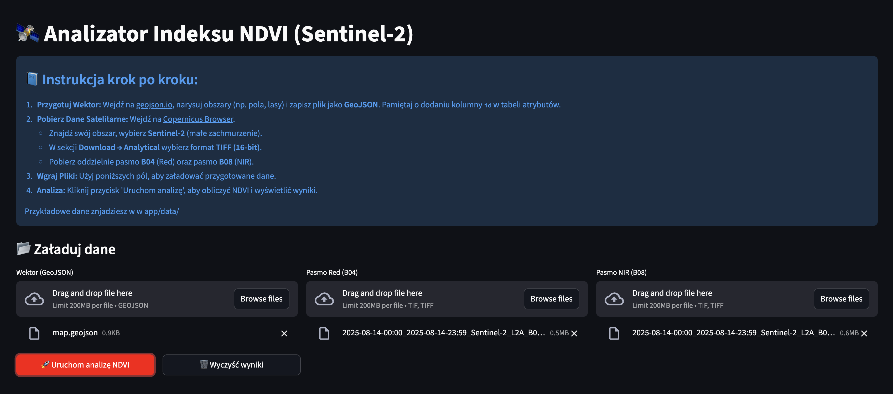
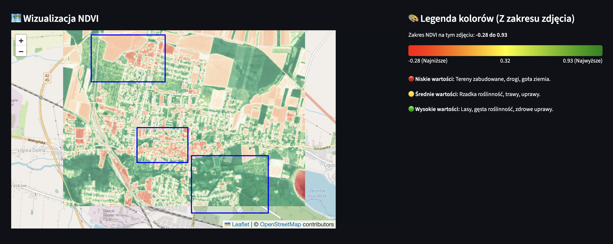
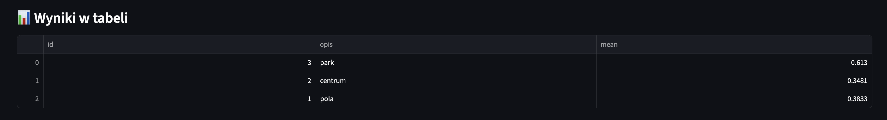

# 🛰️ Sentinel-2 NDVI Analyzer

Aplikacja webowa stworzona w ramach studiów magisterskich (AI, Politechnika Opolska) do analizy wskaźnika wegetacji **NDVI** na podstawie danych satelitarnych **Sentinel-2** oraz danych wektorowych.

## 📋 Wymagania projektowe
Projekt spełnia następujące założenia:
* **Framework**: Streamlit.
* **Dane wektorowe**: Obsługa formatu GeoJSON za pomocą \`geopandas\`.
* **Dane rastrowe**: Obsługa formatu GeoTIFF (Sentinel-2) za pomocą \`rasterio\`.
* **Przetwarzanie**: Obliczanie statystyk zonalnych (średni NDVI dla poligonów).
* **Konteneryzacja**: Docker oraz Docker Compose.
* **Repozytorium**: Kod dostępny publicznie na GitHub.

---

## 🚀 Instrukcja uruchomienia

Aplikacja jest w pełni skonteneryzowana, co eliminuje problemy z instalacją bibliotek GIS (GDAL itp.) na systemie lokalnym.

1. **Sklonuj repozytorium:**
   ```bash
   git clone https://github.com/BartlomiejJurowicz/gis_projekt_2.git
   cd gis_projekt_2

2. **Uruchom aplikację za pomocą Docker Compose:**
   ```bash
   docker-compose up --build

3. **Dostęp do aplikacji:**
   Otwórz przeglądarkę i wejdź pod adres: \`http://localhost:8501\`

---

## 📂 Przygotowanie danych
Aby przeprowadzić analizę, przygotuj:
1.  **Dane wektorowe**: Plik \`.geojson\` z granicami działek/obszarów (np. z [geojson.io](https://geojson.io/)).
2.  **Dane rastrowe**: Dwa pasma z Sentinel-2 (B04 - Red oraz B08 - NIR) pobrane z [Copernicus Browser](https://browser.dataspace.copernicus.eu/).


---

## 📊 Metodologia obliczeń

Aplikacja oblicza znormalizowany różnicowy wskaźnik wegetacji zgodnie ze wzorem 
$$NDVI = \frac{NIR - RED}{NIR + RED}$$
Wynikiem działania programu jest interaktywna mapa z nałożoną warstwą NDVI oraz tabela zawierająca średnie wartości wskaźnika dla każdego zdefiniowanego obszaru wektorowego.



